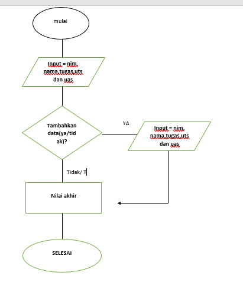
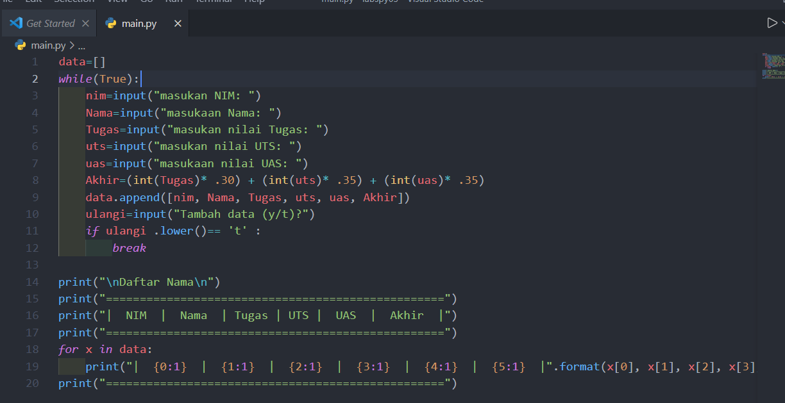
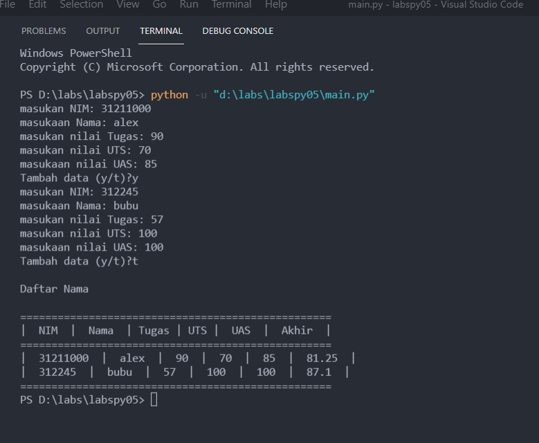

# labspy05

* penjelasan mengenai progra menabahkan data kedalam list

* program ini di buat menggunakan inputan, perulangan, kondisi dan list
* program ini menginputkan sebuah nama nim dan nilai nilai yang nanti nya akan di proses hitung nilai akhir
* perulangan dan kondisi nya di gunakan untuk menentukan apakah ingin menabahkan data lai atau tidak, jika tidak program akan menentukan nilai akhir dari nilai yang di inputkan

*      INPUT

*       OUTPUT
